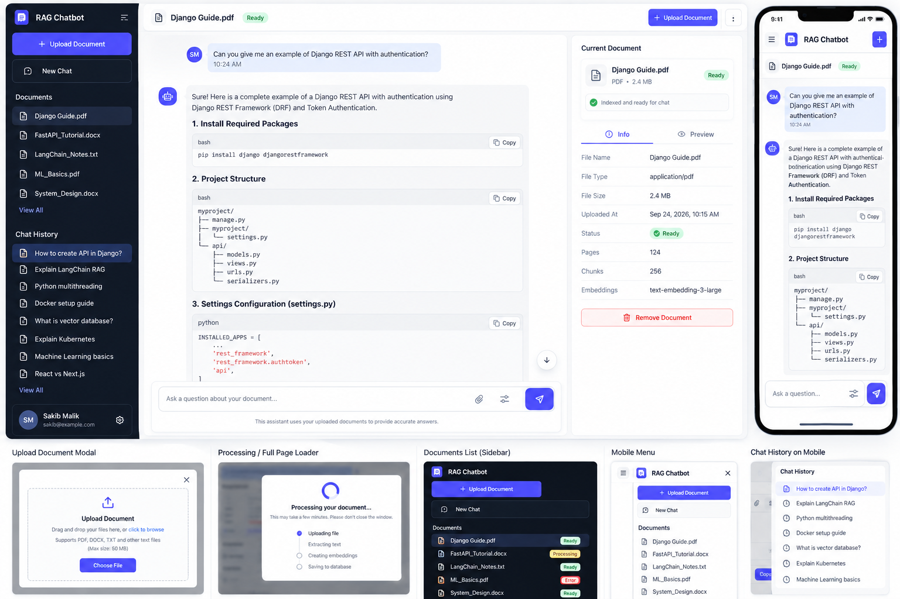

## RAG Chatbot

A retrieval-augmented generation (RAG) chatbot that answers questions using information retrieved from a provided knowledge base. The app combines document retrieval with a language model to produce relevant, context-aware responses.



## Features

- Ask questions in a conversational interface
- Retrieve relevant content from your documents
- Generate answers grounded in the retrieved context
- Simple, user-friendly chat experience

## How RAG Works

1. Documents are loaded and divided into smaller chunks.
2. The chunks are converted into vector embeddings and stored in a vector database.
3. A user question is converted into an embedding.
4. Relevant document chunks are retrieved.
5. The language model uses the retrieved context to generate an answer.

## Getting Started

### Prerequisites

- Python 3.9 or newer
- An API key for the language model provider used by the app

### Installation

```bash
git clone <repository-url>
cd rag-chatbot
python -m venv .venv
```

Activate the virtual environment:

```bash
# Windows
.venv\Scripts\activate

# macOS/Linux
source .venv/bin/activate
```

Install the dependencies:

```bash
pip install -r requirements.txt
```

### Configuration

Create a `.env` file in the project root and add the environment variables required by your application, for example:

```env
OPENAI_API_KEY=your_api_key_here
```

Do not commit `.env` or any API keys to source control.

### Run the App

Use the command configured for your application. For a Streamlit app, this is commonly:

```bash
streamlit run app.py
```

## Project Structure

```text
rag-chatbot/
├── app.py              # Application entry point
├── app.png             # Application screenshot
├── requirements.txt    # Python dependencies
├── .env                # Local environment variables
└── README.md
```

## Usage

1. Start the application.
2. Add or index the documents used as the knowledge base.
3. Enter a question in the chat interface.
4. Review the response generated from the retrieved information.

## Contributing

Contributions are welcome. Create a branch, make your changes, and open a pull request with a clear description of the improvement.

## License

Add the license for this project here.
